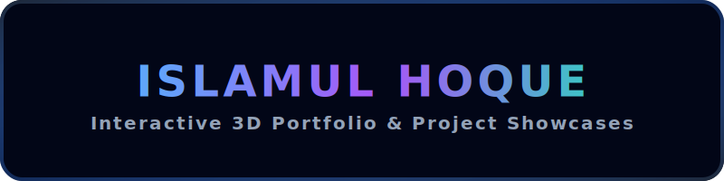

<div align="center">
  
</div>

<br />

<div align="center">
  <a href="https://islamul-hoque-portfolio.vercel.app" target="_blank">
    
  </a>
  <a href="https://github.com/Islamul-Hoque/Portfolio-2.0" target="_blank">
    
  </a>
</div>

<br />

##  Project Overview

Welcome to Portfolio, a state-of-the-art interactive portfolio designed as a premium open-source showcase. Built with Next.js, and React 19, this application represents professional-grade frontend architecture.     
It integrates highly interactive 3D particle simulations, hardware-accelerated scroll animations, and dynamic API configurations to deliver a visually striking and responsive user experience.

---

##  Key Features

- **Interactive 3D Environments**: Built on React Three Fiber and Three.js, rendering a responsive stellar starfield particle canvas reacting to window size and movements.
- **GSAP Orbits & Hover Physics**: Custom rotation systems powering nested circles of technologies in the About section alongside micro-interaction animations.
- **Buttery Smooth Scroll**: Incorporates Lenis scroll logic for inertia-based smooth scrolling across modern browsers.
- **Dynamic Routing & Modals**: Implements Next.js dynamic routing to showcase project case studies, featuring sub-galleries, specifications, and external repositories.
- **Infinite Skills Marquee**: Continuously loop-scrolling technological masteries for visual density.
- **Custom Cursor Tracker**: Floating, responsive cursor following the viewport with spring interpolation.
- **Secure Serverless Form Routing**: Contact section backed by serverless Next.js API routes with Resend integration to process secure form submissions to email inbox.

---

##  Technologies Used

The project is built exclusively with modern packages specified in the environment dependencies:

### Core Framework & Runtimes
- **Next.js 16.1.3** & **React 19.2.3** — React Server Components, App Router, Client hooks, and API routes.
- **JavaScript (ES6+)** — Modern scripting for modularity and performance.

### 3D Rendering Engine
- **Three.js 0.182.0** — Core WebGL library.
- **React Three Fiber 9.5.0** — React wrapper for Three.js.
- **React Three Drei 10.7.7** — Auxiliary helpers and controls.
- **React Three Postprocessing 3.0.4** & **maath 0.10.8** — Post-processing visual shaders and mathematics.

### Animation Suite
- **GSAP 3.14.2** — High-performance scroll triggering, orbits, and custom timelines.
- **Framer Motion 12.27.1** — Declarative UI animations, layout transitions, and page state transformations.
- **React Fast Marquee 1.6.5** — Lightweight infinite ticker animations.

### Styling & Utilities
- **Tailwind CSS v4** & **@tailwindcss/postcss v4** — Utility-first styling framework with instant compilation.
- **tailwind-merge 3.4.0** & **clsx 2.1.1** — Safely merges Tailwind class names without style collisions.

### Services & Feedback
- **Resend 6.9.1** — Secure email delivery platform.
- **React Hot Toast 2.6.0** & **SweetAlert2 11.26.17** — Feedback alerts and loading toasts.
- **Lucide React 0.562.0** & **React Icons 5.5.0** — Rich vector icons.

---

##  Environment Configuration

To process form notifications, create a `.env` (or `.env.local`) file in the root directory.

```bash
# Secure Resend API Key for sending emails from the contact form
RESEND_API_KEY=your_resend_api_key_here
```

> [!NOTE]
> The Next.js API route (`app/api/contact/route.js`) securely fetches this variable server-side. It remains hidden from client-side bundle files.

---

##  Folder Structure

```
├── app/
│   ├── api/
│   │   └── contact/
│   │       └── route.js       # Secure endpoint parsing Resend email triggers
│   ├── project/
│   │   └── [slug]/
│   │       └── page.jsx       # Dynamic routing for detailed project studies
│   ├── globals.css            # Tailwind import directive & root theme styling
│   ├── layout.js              # HTML root wrapper & metadata configurations
│   └── page.js                # Core composite landing page
├── components/
│   ├── About.jsx              # Timeline goals & active GSAP orbit wheels
│   ├── Background.jsx         # WebGL React Three Fiber particle starfield Canvas
│   ├── Contact.jsx            # Dynamic contact form with Resend integrations
│   ├── CustomCursor.jsx       # Custom cursor with spring animations
│   ├── Education.jsx          # Educational timeline entries
│   ├── Experience.jsx         # Developer career and stack journey
│   ├── Footer.jsx             # Site footer structure with links
│   ├── Hero.jsx               # Dynamic typing, call-to-actions, and main intro
│   ├── Navbar.jsx             # Fixed glassmorphic navigation header
│   ├── Projects.jsx           # Categorized showcase layout
│   ├── Skills.jsx             # Skills level tracking
│   ├── SkillsMarquee.jsx      # Infinite loop tech icon marquee
│   └── SmoothScroll.jsx       # Lenis wrapper wrapper for scroll management
├── lib/
│   └── utils.js               # Helper functions (including cn className merger)
├── public/                    # Root static site assets & project screenshots
│   └── icons/                 # Local SVGs for README.md headings
├── package.json               # Scripts, manifest dependencies, and devDependencies
└── eslint.config.mjs          # Lint guidelines config file
```

---

##  Local Installation & Setup

1. **Clone the Repository**
   ```bash
   git clone https://github.com/Islamul-Hoque/Portfolio-2.0.git
   cd Portfolio-2.0
   ```

2. **Install Dependencies**
   ```bash
   npm install
   ```

3. **Configure Environment File**
   Create a `.env` file at the root:
   ```bash
   RESEND_API_KEY=your_resend_api_key_here
   ```

4. **Launch Local Server**
   ```bash
   npm run dev
   ```
   Open `http://localhost:3000` in your browser.

---

##  Deployment Guide

Deploying directly on **Vercel** is recommended:

1. **GitHub Connection**
   Push code changes to your GitHub fork:
   ```bash
   git add .
   git commit -m "Configure production portfolio features"
   git push origin main
   ```
2. **Import Project**
   Go to [Vercel Dashboard](https://vercel.com), click **Add New Project**, and import `Portfolio-2.0`.
3. **Configure Build Settings**
   - **Framework Preset**: Next.js
   - **Build Command**: `npm run build`
   - **Output Directory**: `.next`
4. **Setup Variables**
   Under **Environment Variables**, add:
   - `RESEND_API_KEY` = your active Resend API key credentials.
5. **Deploy**
   Click **Deploy**. Vercel generates preview versions on every branch commit automatically.

---

##  Code Quality

Ensure quality guidelines are clean and uniform before submitting pull requests:
- **Lint Verification**:
  ```bash
  npm run lint
  ```
- **Code Style**: Ensure components are modularized, reusable, and styled using tailwind classes instead of inline style blocks wherever possible.

---

##  Contributing

Contributions to expand features or resolve display bugs are welcome:
1. Fork the project.
2. Create your Feature Branch (`git checkout -b feature/AmazingFeature`).
3. Commit your Changes (`git commit -m 'Add some AmazingFeature'`).
4. Push to the Branch (`git push origin feature/AmazingFeature`).
5. Open a Pull Request.

---

##  License

Distributed under the MIT License. See [LICENSE](LICENSE) for more information.

---

##  Author

### Islamul Hoque
MERN Stack Developer | Backend Enthusiast | Problem Solver

Get in touch or check out my profiles:

<p align="left">
  <a href="https://www.linkedin.com/in/Islamul-Hoque" target="_blank">
    
  </a>
  <a href="mailto:islamulhoque2006@gmail.com">
    
  </a>
  <a href="https://islamul-hoque-portfolio.vercel.app" target="_blank">
    
  </a>
  <a href="https://codeforces.com/profile/Islamul-Hoque" target="_blank">
    
  </a>
  <a href="https://www.hackerrank.com/profile/Islamul_Hoque" target="_blank">
    
  </a>
</p>
